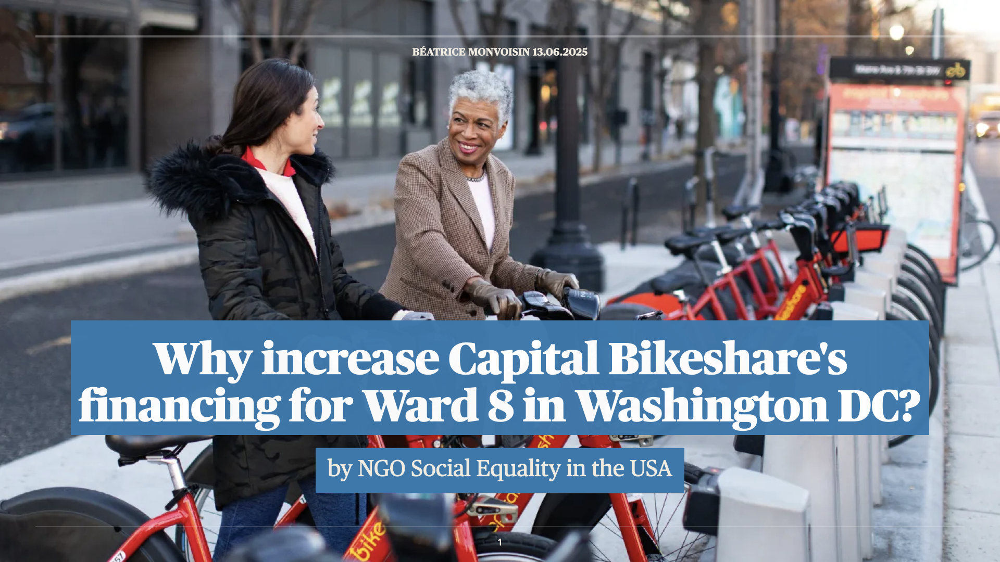
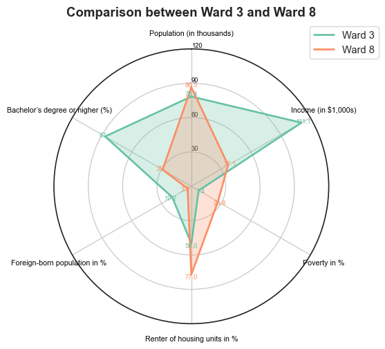
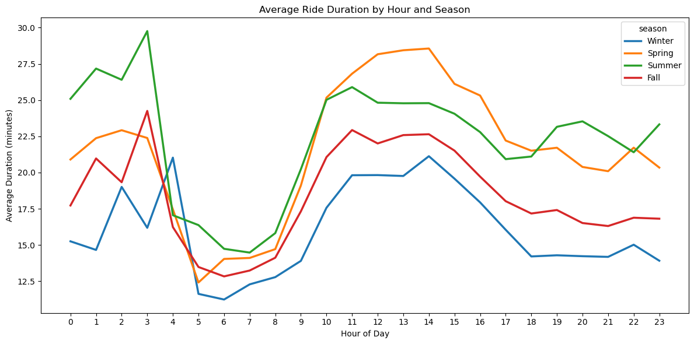
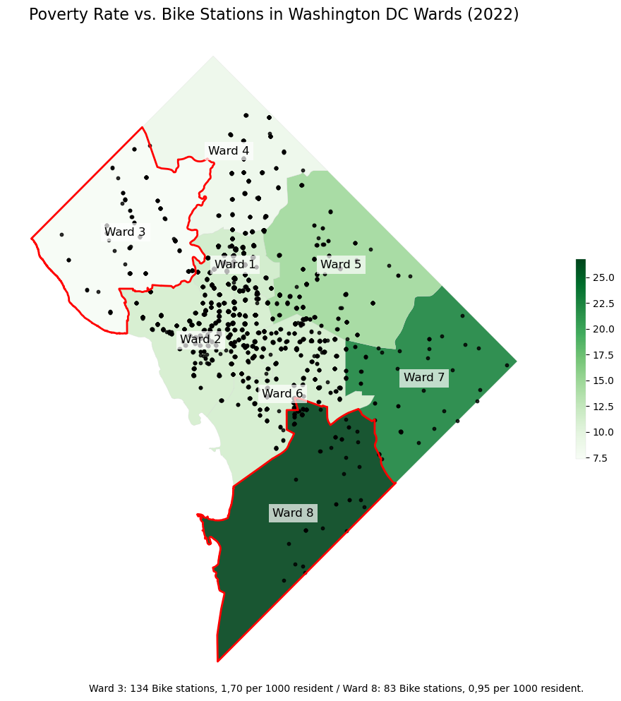
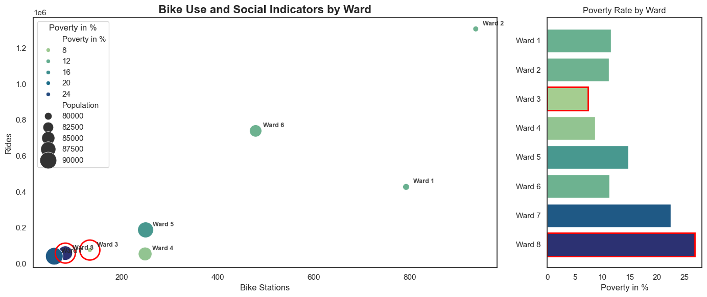
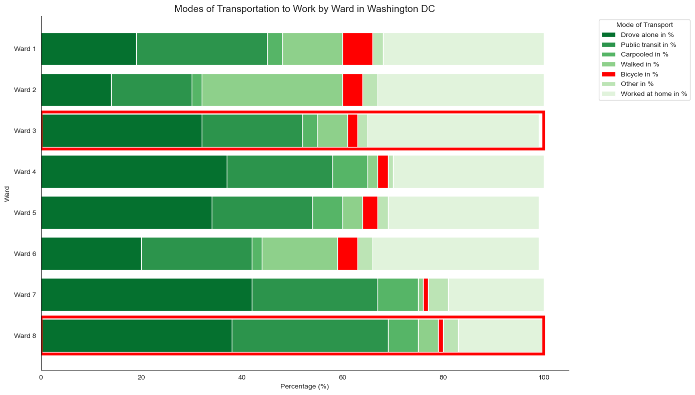
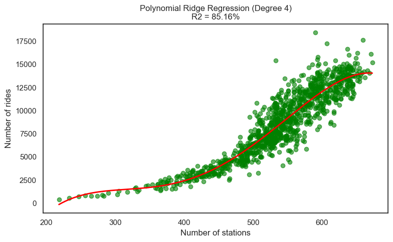

# 🚲 Capital Bikeshare: Why Ward 8 Deserves More Investment

## 📑 Table of Contents
- [📌 Project Overview](#-project-overview)
- [📄 Project Presentation](#-project-presentation)
- [🚴 Bike Sharing Goals](#-bike-sharing-goals)
- [📊 Key Takeaways](#-key-takeaways)
- [📊 Data Sources](#-data-sources)
- [📊 Visualizations](#-visualizations)
- [🗺️ Interactive Map](#️-interactive-map)
- [🤖 Machine Learning Model](#-machine-learning-model)
- [🛠️ Tools & Methods](#️-tools--methods)

---

## 📌 Project Overview
This project analyzes Washington DC's Capital Bikeshare (CBS) data from 2021 to 2023 to explore usage patterns, station performance, and socio-demographic correlations.  
It provides data-driven insights to support strategic decisions, particularly regarding financing and accessibility improvements in **Ward 8**.

---

## 📄 Project Presentation
  
👉 Click on the image or [here](./docs/Capital_Bikeshare_presentation.pdf) to view the full project presentation (PDF).

---

## 🚴 Bike Sharing Goals
- To address traffic congestion  
- To promote sustainable transportation  
- To encourage physical activity  
- To enhance tourism  
- To improve accessibility  

---

## 📊 Key Takeaways
- Ward 8 has **lower income and higher poverty rates**, yet **low access to bike stations**.  
- Increasing investment in Ward 8 would **improve equity in sustainable mobility**.  
- ML model confirms a **strong correlation between socio-economic factors and ridership (R² = 85.16%)**.  

---

## 📊 Data Sources
- **Capital Bikeshare Full Data (2021–2023)**: 13 features including ride_id, bike type, start/end station, coordinates, and user type.  
- **Census Reporter 2023**: 10 features including population, median age, income, poverty rate, housing, education, and foreign-born population.  
- **Open Data DC – Wards (2022)**: Ward geometries for spatial analysis.

---

## 📊 Visualizations
  

  

  

  

  

---

## 🗺️ Interactive Map
  
👉 Click on the image or [here](https://beatricem476.github.io/Bikeshare-project/dc_wards_map.html) to explore the full interactive map.

---

## 🤖 Machine Learning Model
  
*Polynomial Ridge Regression (Degree 4) – R² = 85.16%*

---

## 🛠️ Tools & Methods
- **Languages & Libraries**: Python (Pandas, NumPy, Matplotlib, Seaborn), SQL  
- **Visualization**: Tableau, Jupyter Notebook  
- **Techniques**: Data cleaning, exploratory data analysis, geospatial mapping, KPI evaluation, machine learning.  

---

